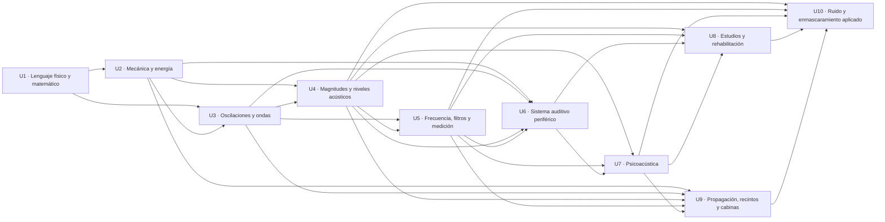

# Mapa de dependencias del curso

## Dependencia principal entre unidades

Las flechas indican dependencia conceptual relevante, no una obligación de repetir el desarrollo completo. U4 es la principal unidad bisagra: sus magnitudes y niveles alimentan todas las unidades posteriores.

## Matriz de prerrequisitos

| Unidad | Matemática requerida | Física requerida | Conceptos recibidos | Conceptos que formaliza o prepara |
|---|---|---|---|---|
| U1 | Aritmética, fracciones, potencias, álgebra elemental | Experiencia cotidiana de medir | Ninguno formal | SI, funciones, trigonometría, logaritmo, análisis dimensional |
| U2 | Proporciones, sustitución, signos, gráficos lineales | Masa, fuerza, presión, velocidad | Magnitudes y unidades de U1 | Fuerza neta, energía, elasticidad, amortiguamiento, termodinámica |
| U3 | Seno/coseno, radianes, despeje, proporcionalidad | Equilibrio, inercia, resorte | U1 y U2 | MAS, onda viajera, fase, \(\lambda\), superposición |
| U4 | Potencias, raíces, logaritmos, promedios | Onda, energía, fuerza, fase | U2 y U3 | Magnitudes acústicas, RMS, niveles, suma, campo y directividad |
| U5 | Funciones, logaritmos, lectura de ejes, sumas | Señal, superposición, presión/RMS | U3 y U4 | Fourier, espectro, respuesta, bandas, filtros, sonometría |
| U6 | Razones, área, frecuencia, lectura de curvas | Presión, fuerza, impedancia, onda viajera | U2–U5 | Transferencia periférica, tonotopía, transducción |
| U7 | Logaritmos básicos, diferencias, proporciones, gráficos | Campo, nivel, espectro, oído periférico | U4–U6 | Umbral, sonoridad, enmascaramiento, inteligibilidad y espacio |
| U8 | Diferencias de niveles, lectura de curvas, porcentajes | Escalas, señal/sistema, vías auditivas | U4–U7 | Comparación de pruebas, exposición, dispositivos |
| U9 | Logaritmos, proporcionalidad, geometría y promedios | \(c=\lambda f\), niveles, bandas, energía | U2–U5 y U7 | Propagación real, recintos, aislamiento y cabinas |
| U10 | Promedios, cuadrados, logaritmos, histogramas | RMS, espectros, bandas, exposición, control | U4, U5, U7, U8 y U9 | Integración de ruido, SNR, enmascaramiento y control |

## Introducción, formalización y recuperación

| Concepto | Se anticipa | Se formaliza | Debe recuperarse |
|---|---|---|---|
| Decibel | U1 | U4 | U5: ponderaciones; U7: sonoridad; U8: HL/SL; U10: exposición |
| Frecuencia y período | U1 | U3 | U5: espectro; U6: tonotopía; U7: pitch |
| Amplitud | U1 | U3–U4 | U5: espectro; U7: no equivale a sonoridad |
| Fuerza y presión | U1 | U2 y U4 | U6: tímpano y oído medio |
| Energía | U2 | U4 | U6: transferencia; U9: superficies; U10: promedios |
| Impedancia | U4 | U4 | U6: adaptación del oído medio |
| Espectro | U5 | U5 | U7: timbre; U8: dispositivos; U10: tipos de ruido |
| Respuesta en frecuencia | U5 | U5 | U6: oído; U8: audífonos |
| Campo libre | U4 | U4 | U7: campo/tímpano; U9: distancia y cabinas |
| Reverberación | U4 | U9 | U7: inteligibilidad; U10: control |
| Enmascaramiento | U7 | U7 | U10: ruido de prueba y aplicación audiométrica |
| Relación señal–ruido | U7 | U7 | U10: caracterización física |
| Exposición | U5 | U8 y U10 | U9: ambiente; U10: métricas y control |

## Repeticiones intencionales

La repetición debe cambiar de nivel o función:

| Repetición | Primera función | Segunda función | Regla pedagógica |
|---|---|---|---|
| Fuente–medio–receptor | U1: organizar el fenómeno | U9/U10: localizar pérdidas y controles | Mantener el esquema y añadir mecanismos. |
| Senoide | U1: función | U3: movimiento/onda | U4: presión y RMS; U5: componente espectral |
| Logaritmo | U1: operación inversa | U4: nivel físico | U5/U10: medición y promedios energéticos |
| Frecuencia | U3: repetición física | U5: eje espectral | U7: contrastar con pitch |
| dB SPL | U4: definición | U7: contrastar con sonoridad | U8: contrastar con dB HL/SL |
| Campo libre | U4: modelo ideal | U7: posición de medición | U9: validez en exteriores y cabinas |
| Ruido | U7: interferencia perceptual | U10: señal física y contexto | No adelantar toda la estadística en U7. |
| Enmascaramiento | U7: elevación del umbral | U10: señal enmascarante y uso audiométrico | La técnica clínica requiere material externo. |

## Dependencias críticas por unidad

### U1

- **Puerta de entrada:** aritmética y lectura de unidades.
- **Dificultad típica:** tratar símbolos como números sin significado físico.
- **Error a diagnosticar:** masa/peso, inversa/recíproco, frecuencia/pitch.
- **Intervención:** ejercicios breves de clasificación y análisis dimensional antes de fórmulas.

### U2

- **Puerta de entrada:** distinguir sistema, interacción y fuerza neta.
- **Dificultad típica:** mezclar mecánica y termodinámica sin un balance común.
- **Error a diagnosticar:** acción/reacción sobre el mismo cuerpo; calor almacenado; energía “perdida”.
- **Intervención:** diagramas de sistema y rutas de energía.

### U3

- **Puerta de entrada:** senoide y posición de equilibrio.
- **Dificultad típica:** una misma curva puede representar tiempo o espacio.
- **Error a diagnosticar:** partícula que viaja con la onda; \(u=c\); frecuencia alta implica mayor \(c\).
- **Intervención:** pares coordinados de gráfica temporal y espacial.

### U4 — carga muy alta

- **Dependencias simultáneas:** mecánica, ondas, promedios, logaritmos y geometría.
- **Nudos:** \(p/u/I/W\); pico/RMS; 10 frente a 20; coherencia; ley del cuadrado inverso; directividad.
- **Errores:** “dB mide intensidad”, “dos fuentes suman siempre 3 dB”, “duplicar distancia siempre resta 6 dB”.
- **Bloques recomendados:**  
  1. fenómeno, medio y campo;  
  2. magnitudes;  
  3. valores de señal;  
  4. niveles y referencias;  
  5. suma;  
  6. geometría, distancia y directividad.
- **Recapitulaciones:** después de 2, 4 y 6.

### U5 — carga muy alta

- **Dependencias simultáneas:** señal temporal, fase, RMS, dB, lectura de gráficos.
- **Nudos:** señal vs sistema; Fourier vs mecanismo físico; bin vs banda; fundamental vs pico mayor; filtro vs ponderación.
- **Errores:** “FFT es intensidad”, “espectro = respuesta”, “A convierte SPL en audición”.
- **Bloques recomendados:** dominios; Fourier; registro digital; señal/sistema; componentes; bandas/filtros; ponderaciones/sonómetro.
- **Recapitulaciones:** mini tabla “qué objeto se representa” al cerrar cada bloque.

### U6 — carga muy alta

- **Dependencias simultáneas:** anatomía, fuerzas, impedancia, ondas, función de transferencia y electrofisiología.
- **Nudos:** transformación sin creación de energía; conducción ósea multimecanismo; onda viajera; CCI/CCE; transducción.
- **Errores:** “oído medio amplifica energía”, “cóclea hace FFT”, “cada frecuencia ocupa un punto fijo”.
- **Bloques recomendados:** externo; medio; ósea; cóclea; órgano de Corti; codificación.
- **Recapitulación común:** entrada → transformación → salida → límite de la inferencia.

### U7 — carga muy alta

- **Dependencias simultáneas:** niveles, espectros, oído periférico, psicofísica y escucha espacial.
- **Nudos:** pares físico/perceptual; isofónicas; fones/sones; filtros auditivos; SNR/inteligibilidad; precedencia; ITD/ILD.
- **Errores:** “fon = dB SPL”, “SNR fija inteligibilidad”, “Haas es una regla de 20 ms”.
- **Bloques recomendados:** umbral/sensibilidad; atributos/sonoridad; enmascaramiento; voz/recinto; reflexiones; espacio/escenas.
- **Recapitulación común:** estímulo → tarea → respuesta → condiciones.

### U8

- **Puerta de entrada:** separar exposición, síntoma, función y resultado.
- **Dificultad típica:** memorizar pruebas sin comprender la cadena de medición.
- **Error a diagnosticar:** patrón = diagnóstico; OEA presente = audición normal; más electrodos = más perceptos independientes.
- **Intervención:** matriz común de seis preguntas para cada estudio.

### U9

- **Puerta de entrada:** conservar por separado divergencia, absorción, reflexión, transmisión y difracción.
- **Dificultad típica:** aplicar reglas ideales como correcciones universales.
- **Error a diagnosticar:** absorber = aislar; reflexión = reverberación; dB(A) único certifica cabina.
- **Intervención:** diagramas de trayectos y balances por mecanismo.

### U10

- **Puerta de entrada:** media, RMS, nivel equivalente y espectro.
- **Dificultad típica:** combinar estadística, exposición, percepción y control.
- **Error a diagnosticar:** aleatorio = no medible; blanco = igual energía por octava; enmascarar = proteger.
- **Intervención:** comparar señales con igual RMS y distinta estadística/espectro.

## Puntos de control antes de avanzar

| Fin de unidad | Evidencia mínima |
|---|---|
| U1 | Identifica magnitud, símbolo, valor y unidad; resuelve una relación directa/inversa. |
| U2 | Dibuja fuerzas y explica un balance de energía. |
| U3 | Lee \(T\) y \(\lambda\) en gráficos diferentes y calcula \(c\). |
| U4 | Distingue magnitudes y calcula un nivel con referencia. |
| U5 | Decide si un gráfico representa señal o sistema y explica sus ejes. |
| U6 | Reconstruye la cadena auditiva sin saltar de presión a percepción. |
| U7 | Separa estímulo, tarea y respuesta en un resultado psicofísico. |
| U8 | Compara dos pruebas sin convertir resultados en diagnósticos. |
| U9 | Identifica el mecanismo dominante de cada trayecto. |
| U10 | Clasifica un ruido temporal y espectralmente y elige una estrategia de control. |

